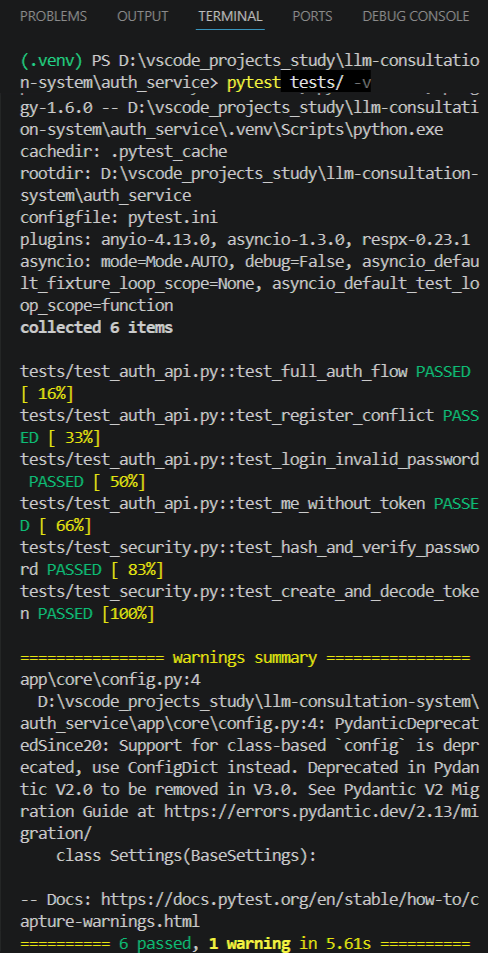
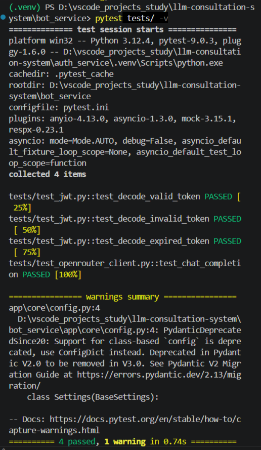

# LLM Consultation System: Двухсервисная архитектура с JWT и асинхронной обработкой

Учебный проект распределённой системы, состоящей из двух независимых сервисов:
- **Auth Service** (FastAPI) — регистрация, аутентификация и выпуск JWT-токенов
- **Bot Service** (aiogram + Celery) — Telegram-бот с асинхронной обработкой LLM-запросов

Архитектура построена по принципу разделения ответственности: Bot Service не знает о паролях и пользователях, он доверяет только корректно подписанному JWT-токену. Запросы к LLM выполняются асинхронно через очередь RabbitMQ.

---

## Содержание

- [Архитектура](#архитектура)
- [Требования](#требования)
- [Установка и запуск](#установка-и-запуск)
- [Использование](#использование)
- [Важно: доступ к OpenRouter и VPN](#важно-доступ-к-openrouter-и-vpn)
- [Особенности реализации](#особенности-реализации)
- [Выбор бесплатной модели](#выбор-бесплатной-модели)
- [Предупреждение о конфиденциальности (от OpenRouter)](#предупреждение-о-конфиденциальности-от-openrouter)
- [Тестирование](#тестирование)
- [Демонстрация работы (скриншоты)](#демонстрация-работы-скриншоты)
- [Структура проекта](#структура-проекта)

---

## Архитектура

**Два независимых сервиса:**

### Auth Service (FastAPI + SQLite)
Регистрация → Хеширование пароля → Выпуск JWT

### Bot Service (aiogram + Celery)
Пользователь → Telegram → Redis (JWT) → RabbitMQ → Celery Worker → OpenRouter → Ответ

**Ключевой принцип:** Bot Service не знает о пользователях и паролях. Он доверяет только JWT-токену, подписанному Auth Service.


- **Auth Service** — единственный источник JWT-токенов. Хранит пользователей в SQLite, пароли хеширует bcrypt.
- **Bot Service** — принимает JWT, валидирует подпись и срок, публикует задачи в RabbitMQ.
- **RabbitMQ** — брокер задач Celery.
- **Redis** — хранилище JWT-токенов и кэш ответов.
- **Celery Worker** — обрабатывает задачи асинхронно, вызывает OpenRouter API.

---

## Требования

- Python 3.11+
- Менеджер зависимостей uv
- RabbitMQ (локальная установка или Docker)
- Redis (локальная установка или Docker)
- Telegram Bot Token (от @BotFather)
- OpenRouter API-ключ

---

## Установка и запуск

### 1. Клонирование репозитория

```bash
git clone <url-репозитория>
cd llm-consultation-system
```

### 2. Установка и запуск RabbitMQ

RabbitMQ должен быть установлен и запущен локально.
Веб-интерфейс управления: http://localhost:15672 (guest/guest)

### 3. Установка и запуск Redis

Redis должен быть установлен и запущен локально на порту 6379.

### 4. Auth Service

```bash
cd auth_service
uv venv
.venv\Scripts\activate.bat  # Windows
source .venv/bin/activate   # Mac/Linux
```

Установка зависимостей

```bash
uv pip compile pyproject.toml -o requirements.txt
uv pip install -r requirements.txt
```

Запуск:

```bash
uv run uvicorn app.main:app --reload --host 0.0.0.0 --port 8000
```

Swagger: http://127.0.0.1:8000/docs

### 5. Bot Service

```bash
cd bot_service
uv venv
.venv\Scripts\activate.bat  # Windows
source .venv/bin/activate   # Mac/Linux
uv pip compile pyproject.toml -o requirements.txt
uv pip install -r requirements.txt
```

Заполните .env:

- TELEGRAM_BOT_TOKEN — токен от @BotFather

- OPENROUTER_API_KEY — ключ OpenRouter

Запуск Celery Worker:

```bash
celery -A app.infra.celery_app worker --loglevel=info --pool=solo
```

Запуск Telegram-бота (в другом терминале):

```bash
python -c "import asyncio; from app.bot.dispatcher import bot, dp; asyncio.run(dp.start_polling(bot))"
```
---

## Использование

### 1. Зарегистрируйтесь в Auth Service через Swagger (POST /auth/register).

Используйте ввод email в формате : surname@email.com

### 2. Войдите (POST /auth/login) и получите JWT-токен.

### 3. (проверка) Авторизация в Swagger: кнопка Authorize вверху справа. 

Вставить email, password, в client_id - поставить 1, client_secret = вставить JWT-токен.

### 4. Получение Telegram Bot Token

1. Откройте Telegram, найдите @BotFather
2. Отправьте команду `/newbot`
3. Следуйте инструкциям для создания бота : укажите name (отображаемое название) и username (уникальное имя бота для поиска)
4. Полученный токен укажите в созданном Вами файле `bot_service/.env` (или в существующий шаблон `bot_service/.env.example`)


### 5. В Telegram найдите бота (@указанное_Вами_username_в_BotFather), запустите 

```bash
/start
```

и отправьте JWT-токен:

```bash
/token <JWT>
```

Отправьте любой вопрос — бот передаст его в очередь, Celery обработает и вернёт ответ от LLM.

---

## Важно: доступ к OpenRouter и VPN

Для получения API-ключа и работы сервиса может потребоваться VPN, так как OpenRouter может быть недоступен с некоторых IP-адресов.

1. Перейдите на [OpenRouter](https://openrouter.ai) и зарегистрируйтесь
2. Создайте API-ключ в разделе [Keys](https://openrouter.ai/keys)
3. Укажите ключ в файле `bot_service/.env`

Если при отправке запроса боту возникает ошибка соединения, попробуйте включить VPN и перезапустить Celery Worker.

---

## Особенности реализации

### Локальная установка RabbitMQ и Redis

В связи с ограничениями версии Windows 10 (сборка без поддержки Docker Desktop), все вспомогательные сервисы (RabbitMQ, Redis) были установлены нативно, как службы Windows.  
Это полностью соответствует архитектуре проекта и не влияет на его функциональность. При наличии Docker проект легко переносится в контейнеры.

### Асинхронная обработка и уведомления

Для обеспечения динамики Telegram-бота запросы к LLM выполняются асинхронно через Celery.  
После отправки вопроса пользователь сразу получает уведомление **"Запрос принят"** - индикатор успешной публикации задачи в очередь RabbitMQ. Ответ от LLM возвращается следующим сообщением после обработки.

### Управление поведением модели

Для ускорения ответа и улучшения пользовательского опыта в Celery-задачу добавлен системный промпт, инструктирующий модель отвечать кратко (3-4 предложения). Т.к. иногда модель может отвечать настолько развёрнуто - что "застревает" по разным техническим причинам. И пользователю неочевидно почему нет ответа от LLM - на каком этапе техническая поломка/заминка.

При этом модель может выдавать и более развёрнутые ответы, если посчитает нужным — это поведение зависит от конкретного запроса и выбранной модели.

Системный промпт можно изменить или убрать в файле `bot_service/app/tasks/llm_tasks.py`.

---

## Выбор бесплатной модели

В проекте использовалась модель:
```bash
nvidia/nemotron-3-super-120b-a12b:free
```
Список бесплатных моделей OpenRouter обновляется.
Если модель перестала работать (ошибка 404), найдите актуальную бесплатную модель в коллекции:
https://openrouter.ai/collections/free-models

Замените значение OPENROUTER_MODEL в Вашем созданном файле .env (bot_service) или в существующем шаблоне .env.example (bot_service) на новое.

---

## Предупреждение о конфиденциальности (от OpenRouter)

При использовании бесплатных моделей OpenRouter все запросы и ответы логируются провайдером.
Не отправляйте личные, конфиденциальные или чувствительные данные.
Бесплатные модели предназначены только для тестирования.

---

## Тестирование

Проект покрыт автоматическими тестами на pytest. Они проверяют ключевые части системы и не требуют запущенных сервисов (Redis, RabbitMQ, OpenRouter) — всё работает локально.

### Что проверяется

**Auth Service (6 тестов)**
- Правильно ли хешируются и проверяются пароли
- Корректно ли создаются и декодируются JWT-токены
- Работает ли полный сценарий: регистрация → вход → получение профиля
- Правильно ли возвращаются ошибки (409 при дублировании email, 401 при неверном пароле, 401 без токена)

**Bot Service (4 теста)**
- Принимает ли бот валидный JWT
- Отклоняет ли "мусорный" токен
- Отклоняет ли истёкший токен
- Правильно ли клиент OpenRouter отправляет запрос и получает ответ (без реального интернета)


Запуск тестов:

```bash
# Auth Service
cd auth_service
pytest tests/ -v

# Bot Service
cd bot_service
pytest tests/ -v
```

---

## Демонстрация работы (скриншоты)

### 1. Регистрация пользователя (Auth Service)


### 2. Вход и получение JWT-токена


### 3. Авторизация в Swagger


### 4. История общения с ботом : отправка токена (/token) и общение


### 5. Интерфейс RabbitMQ


### 6. Тестирование Auth Service


### 7. Тестирование Bot Service


## Структура проекта

```bash
llm-consultation-system/
├── auth_service/
│   ├── app/
│   │   ├── api/
│   │   │   ├── deps.py                 # Зависимости FastAPI (сессия БД, репозитории, usecase)
│   │   │   └── routes_auth.py          # Эндпоинты /auth/*
│   │   ├── core/
│   │   │   ├── config.py               # Настройки приложения (JWT, БД, окружение)
│   │   │   ├── exceptions.py           # HTTP-исключения
│   │   │   └── security.py             # Хеширование паролей и JWT-токены
│   │   ├── db/
│   │   │   ├── base.py                 # Базовый класс SQLAlchemy
│   │   │   ├── models.py               # Модель User
│   │   │   └── session.py              # Асинхронный движок SQLite и фабрика сессий
│   │   ├── repositories/
│   │   │   └── users.py                # Репозиторий пользователей
│   │   ├── schemas/
│   │   │   ├── auth.py                 # Схемы регистрации и токена
│   │   │   └── user.py                 # Публичная схема пользователя
│   │   ├── usecases/
│   │   │   └── auth.py                 # Бизнес-логика: регистрация, вход, профиль
│   │   └── main.py                     # Точка входа FastAPI
│   ├── tests/
│   │   ├── __init__.py
│   │   ├── conftest.py                 # Фикстуры (тестовая БД, HTTP-клиент)
│   │   ├── test_auth_api.py            # Интеграционные тесты (регистрация, логин, /me)
│   │   └── test_security.py            # Модульные тесты (хеширование, JWT)
│   ├── pytest.ini                      # Конфигурация pytest
│   ├── .env                            # Переменные окружения
│   ├── pyproject.toml                  # Зависимости проекта (uv)
├── bot_service/
│   ├── app/
│   │   ├── bot/
│   │   │   ├── dispatcher.py           # Bot и Dispatcher (aiogram)
│   │   │   └── handlers.py             # Обработчики /token и текста
│   │   ├── core/
│   │   │   ├── config.py               # Настройки (Telegram, Redis, Celery, OpenRouter)
│   │   │   └── jwt.py                  # Проверка JWT
│   │   ├── infra/
│   │   │   ├── celery_app.py           # Конфигурация Celery (RabbitMQ — брокер, Redis — backend)
│   │   │   └── redis.py                # Подключение к Redis
│   │   ├── services/
│   │   │   └── openrouter_client.py    # Клиент OpenRouter API (отправка запросов к LLM)
│   │   ├── tasks/
│   │   │   └── llm_tasks.py            # Celery-задача : запрос к LLM и сохранение ответа
│   │   └── main.py                     # FastAPI (health-check)
│   ├── tests/
│   │   ├── __init__.py
│   │   ├── conftest.py                 # Фикстуры (fakeredis)
│   │   ├── test_jwt.py                 # Тесты валидации JWT
│   │   └── test_openrouter_client.py   # Мок-тест клиента OpenRouter (respx)
│   ├── pytest.ini                      # Конфигурация pytest
│   ├── .env                            # Переменные окружения (не в репозитории)
│   ├── .env.example                    # Шаблон переменных окружения
│   ├── pyproject.toml                  # Зависимости проекта (uv)
├── screenshots/
│   ├── fpj_authorize_1.png             # Авторизация в Swagger
│   ├── fpj_authorize_2.png
│   ├── fpj_post_1.png                  # Логин
│   ├── fpj_post_2.png
│   ├── fpj_rabbitmq_itfce.png          # Очереди RabbitMQ
│   ├── fpj_regist_1.png                # Регистрация
│   ├── fpj_regist_2.png
│   ├── fpj_regist_3.png
│   ├── fpj_scr_bot_1.png               # Telegram-бот
│   ├── fpj_scr_bot_2.png
│   ├── fpj_scr_bot_3.png
│   ├── fpj_scr_bot_4.png
│   ├── fpj_scr_bot_5.png
│   ├── fpj_scr_bot_6.png
│   ├── fpj_scr_bot_7.png
│   ├── fpj_tests_auth.png              # Тесты Auth Service
│   ├── fpj_tests_bot.png               # Тесты Bot Service
├── .gitignore                          # Исключения для Git
└── README.md                           # Документация проекта
```

*Примечание: файл `app.db` (база SQLite) создаётся автоматически при первом запуске и не включён в репозиторий.*


Автор : студент Захарина.

Лицензия

Проект создан в учебных целях.
