# LLM Consultation System: Двухсервисная система с JWT и очередями

Учебный проект распределённой системы, состоящей из двух независимых сервисов:
- **Auth Service** (FastAPI) — регистрация, аутентификация и выпуск JWT-токенов
- **Bot Service** (aiogram + Celery) — Telegram-бот с асинхронной обработкой LLM-запросов

Архитектура построена по принципу разделения ответственности: Bot Service не знает о паролях и пользователях, он доверяет только корректно подписанному JWT-токену. Запросы к LLM выполняются асинхронно через очередь RabbitMQ.

---

## Содержание

- [Архитектура](#архитектура)
- [Требования](#требования)
- [Установка и запуск](#установка-и-запуск)
- [Использование](#использование)
- [Важно: доступ к OpenRouter и VPN](#важно-доступ-к-openrouter-и-vpn)
- [Выбор бесплатной модели](#выбор-бесплатной-модели)
- [Предупреждение о конфиденциальности (от OpenRouter)](#предупреждение-о-конфиденциальности-от-openrouter)
- [Демонстрация работы (скриншоты)](#демонстрация-работы-скриншоты)
- [Структура проекта](#структура-проекта)

---

## Архитектура

**Два независимых сервиса:**

### Auth Service (FastAPI + SQLite)
Регистрация → Хеширование пароля → Выпуск JWT

### Bot Service (aiogram + Celery)
Пользователь → Telegram → Redis (JWT) → RabbitMQ → Celery Worker → OpenRouter → Ответ

**Ключевой принцип:** Bot Service не знает о пользователях и паролях. Он доверяет только JWT-токену, подписанному Auth Service.


- **Auth Service** — единственный источник JWT-токенов. Хранит пользователей в SQLite, пароли хеширует bcrypt.
- **Bot Service** — принимает JWT, валидирует подпись и срок, публикует задачи в RabbitMQ.
- **RabbitMQ** — брокер задач Celery.
- **Redis** — хранилище JWT-токенов и кэш ответов.
- **Celery Worker** — обрабатывает задачи асинхронно, вызывает OpenRouter API.

---

## Требования

- Python 3.11+
- Менеджер зависимостей uv
- RabbitMQ (локальная установка или Docker)
- Redis (локальная установка или Docker)
- Telegram Bot Token (от @BotFather)
- OpenRouter API-ключ

---

## Установка и запуск

### 1. Клонирование репозитория

```bash
git clone <url-репозитория>
cd llm-consultation-system
```

### 2. Установка и запуск RabbitMQ

RabbitMQ должен быть установлен и запущен локально.
Веб-интерфейс управления: http://localhost:15672 (guest/guest)

### 3. Установка и запуск Redis

Redis должен быть установлен и запущен локально на порту 6379.

### 4. Auth Service

```bash
cd auth_service
uv venv
.venv\Scripts\activate.bat  # Windows
source .venv/bin/activate   # Mac/Linux
```

Установка зависимостей

```bash
uv pip compile pyproject.toml -o requirements.txt
uv pip install -r requirements.txt
```

Запуск:

```bash
uv run uvicorn app.main:app --reload --host 0.0.0.0 --port 8000
```

Swagger: http://127.0.0.1:8000/docs

### 5. Bot Service

```bash
cd bot_service
uv venv
.venv\Scripts\activate.bat  # Windows
source .venv/bin/activate   # Mac/Linux
uv pip compile pyproject.toml -o requirements.txt
uv pip install -r requirements.txt
```

Заполните .env:

- TELEGRAM_BOT_TOKEN — токен от @BotFather

- OPENROUTER_API_KEY — ключ OpenRouter

Запуск Celery Worker:

```bash
celery -A app.infra.celery_app worker --loglevel=info --pool=solo
```

Запуск Telegram-бота (в другом терминале):

```bash
python -c "import asyncio; from app.bot.dispatcher import bot, dp; asyncio.run(dp.start_polling(bot))"
```

## Использование

### 1. Зарегистрируйтесь в Auth Service через Swagger (POST /auth/register).

Используйте ввод email в формате : surname@email.com

### 2. Войдите (POST /auth/login) и получите JWT-токен.

### 3. (проверка) Авторизация в Swagger: кнопка Authorize вверху справа. 

Вставить email, password, в client_id - поставить 1, client_secret = вставить JWT-токен.

### 4. Получение Telegram Bot Token

1. Откройте Telegram, найдите @BotFather
2. Отправьте команду `/newbot`
3. Следуйте инструкциям для создания бота : укажите name (отображаемое название) и username (уникальное имя бота для поиска)
4. Полученный токен укажите в созданном Вами файле `bot_service/.env` (или в существующий шаблон `bot_service/.env.example`)


### 5. В Telegram найдите бота (@указанное_Вами_username_в_BotFather), запустите 

```bash
/start
```

и отправьте JWT-токен:

```bash
/token <JWT>
```

Отправьте любой вопрос — бот передаст его в очередь, Celery обработает и вернёт ответ от LLM.

## Важно: доступ к OpenRouter и VPN

Для получения API-ключа и работы сервиса может потребоваться VPN, так как OpenRouter может быть недоступен с некоторых IP-адресов.

1. Перейдите на [OpenRouter](https://openrouter.ai) и зарегистрируйтесь
2. Создайте API-ключ в разделе [Keys](https://openrouter.ai/keys)
3. Укажите ключ в файле `bot_service/.env`

Если при отправке запроса боту возникает ошибка соединения, попробуйте включить VPN и перезапустить Celery Worker.

---

## Выбор бесплатной модели

В проекте использовалась модель:
```bash
nvidia/nemotron-3-super-120b-a12b:free
```
Список бесплатных моделей OpenRouter обновляется.
Если модель перестала работать (ошибка 404), найдите актуальную бесплатную модель в коллекции:
https://openrouter.ai/collections/free-models

Замените значение OPENROUTER_MODEL в Вашем созданном файле .env (bot_service) или в существующем шаблоне .env.example (bot_service) на новое.

---

## Предупреждение о конфиденциальности (от OpenRouter)

При использовании бесплатных моделей OpenRouter все запросы и ответы логируются провайдером.
Не отправляйте личные, конфиденциальные или чувствительные данные.
Бесплатные модели предназначены только для тестирования.

---

## Демонстрация работы (скриншоты)

### 1. Регистрация пользователя (Auth Service)
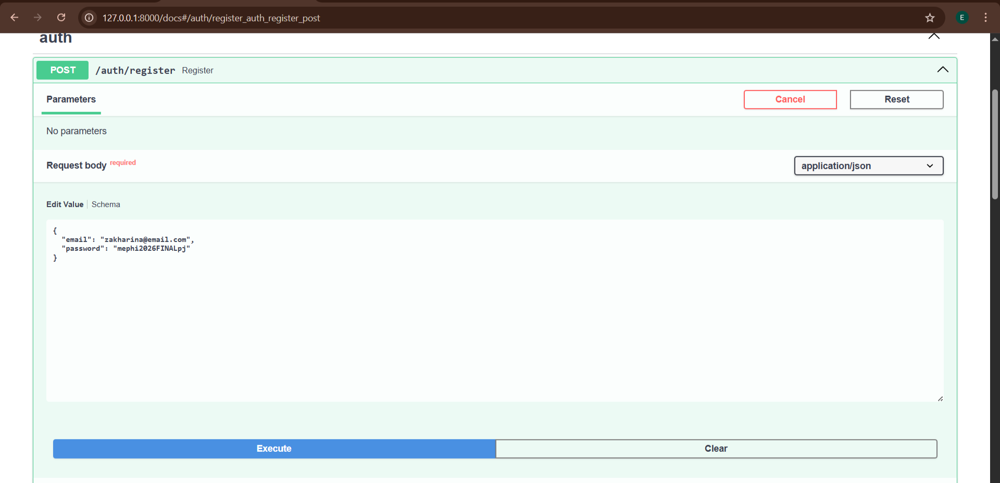
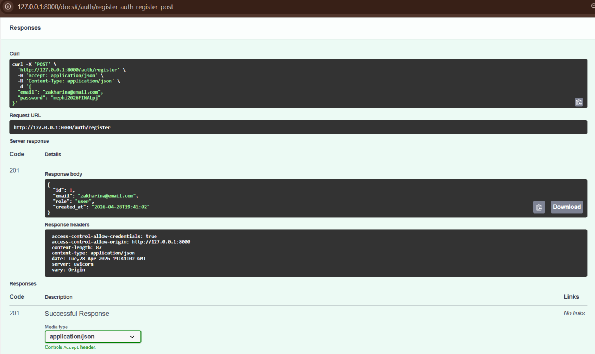
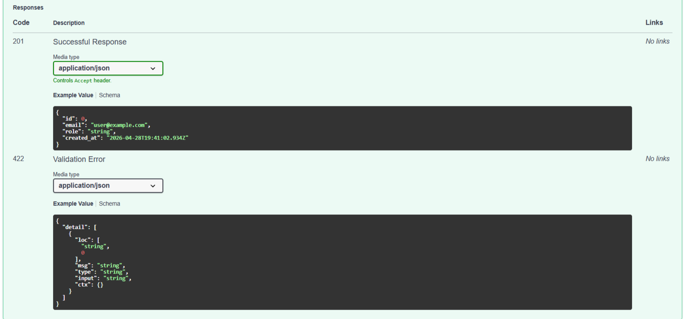

### 2. Вход и получение JWT-токена
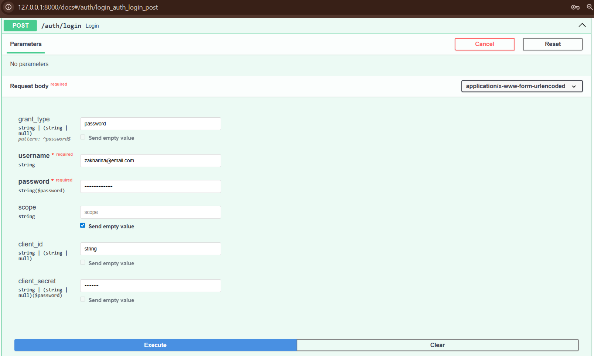
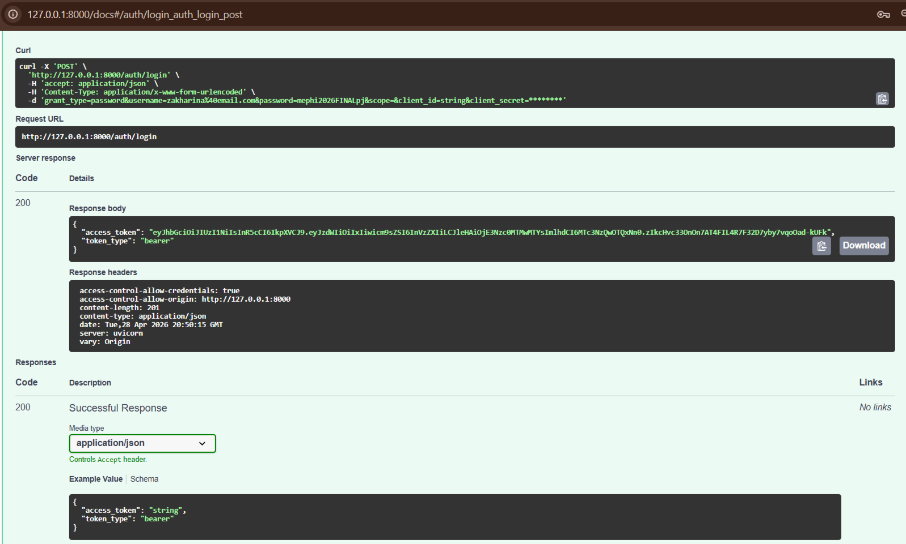

### 3. Авторизация в Swagger
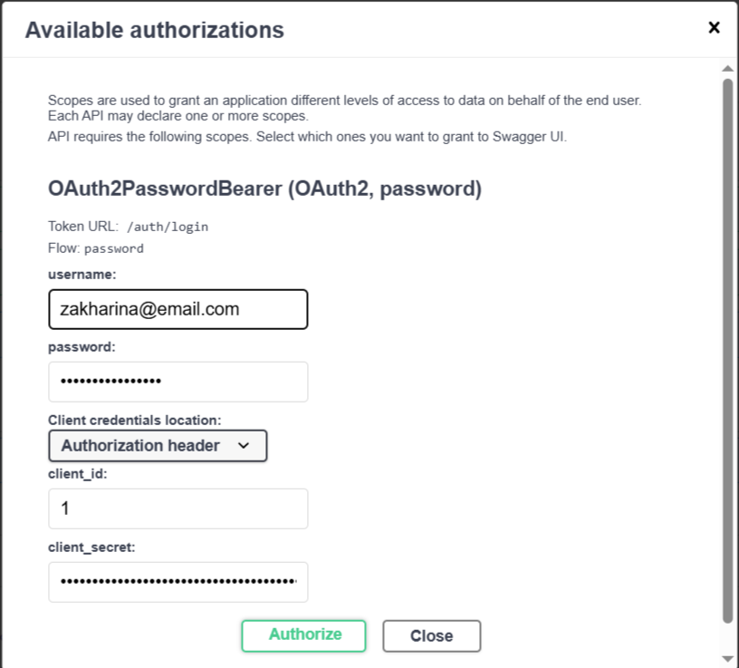
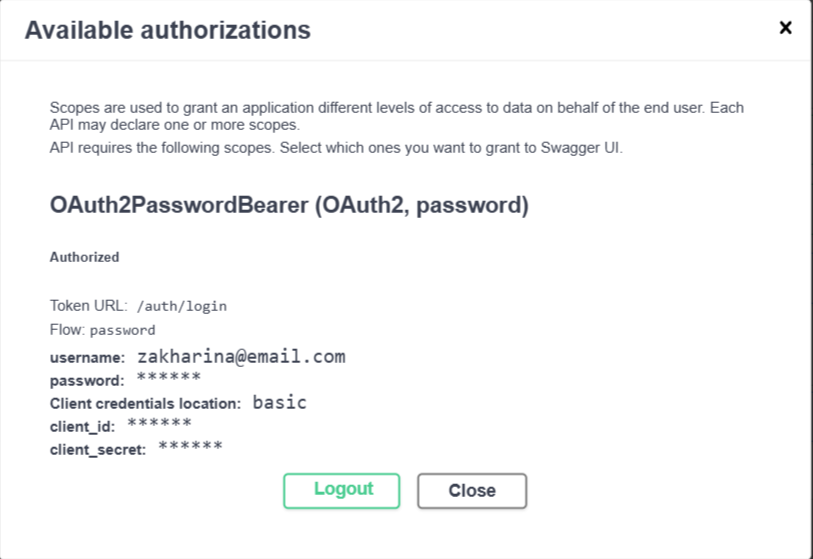

### 4. История общения с ботом : отправка токена (/token) и общение
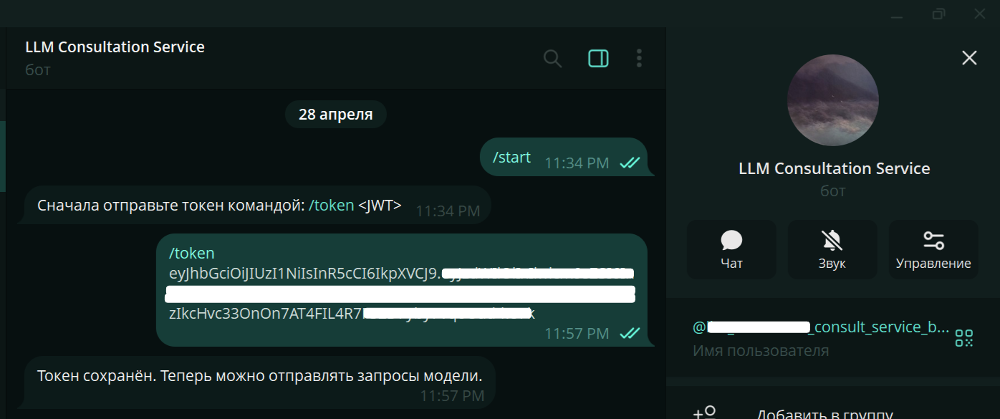
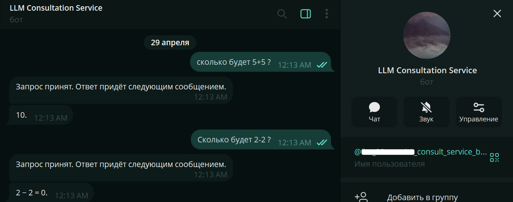
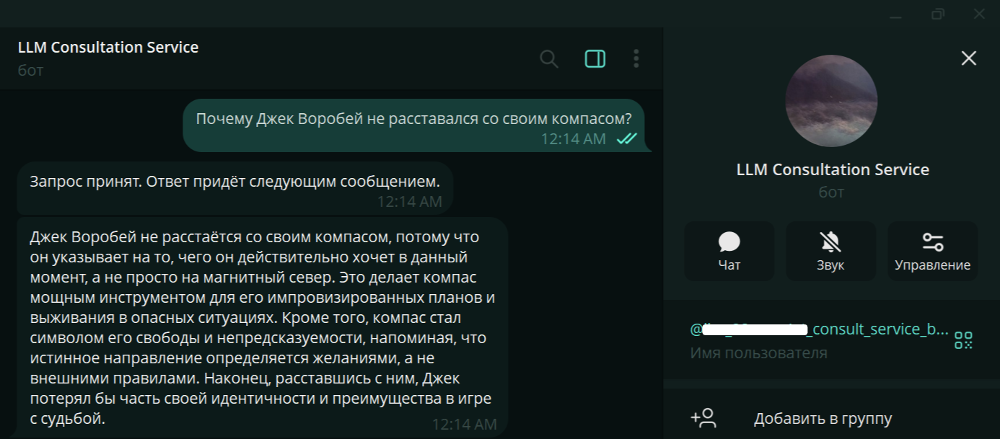
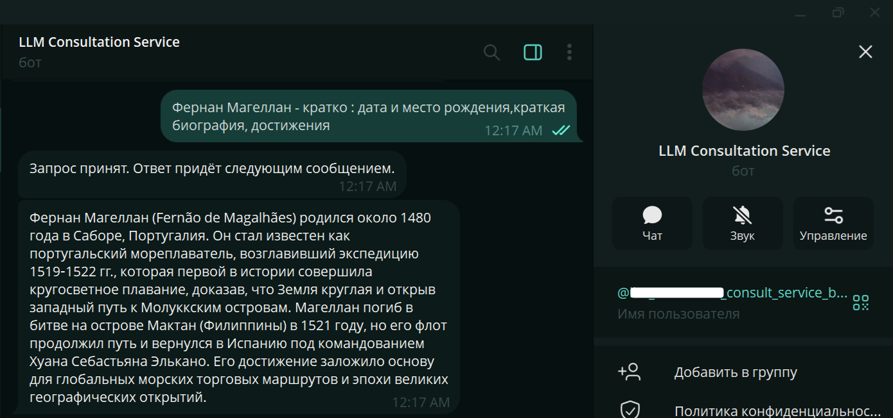
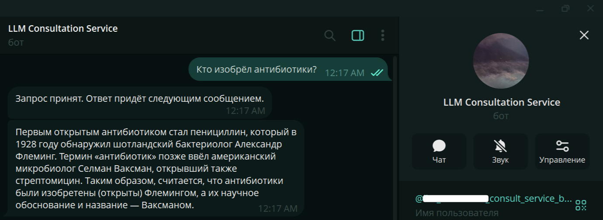
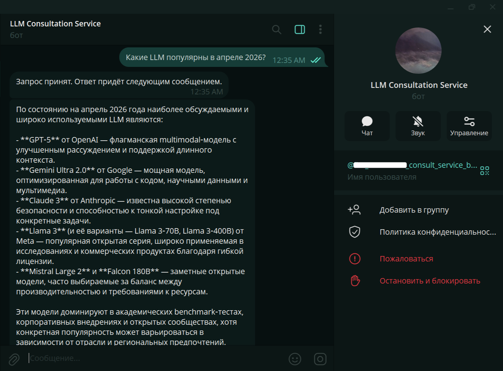
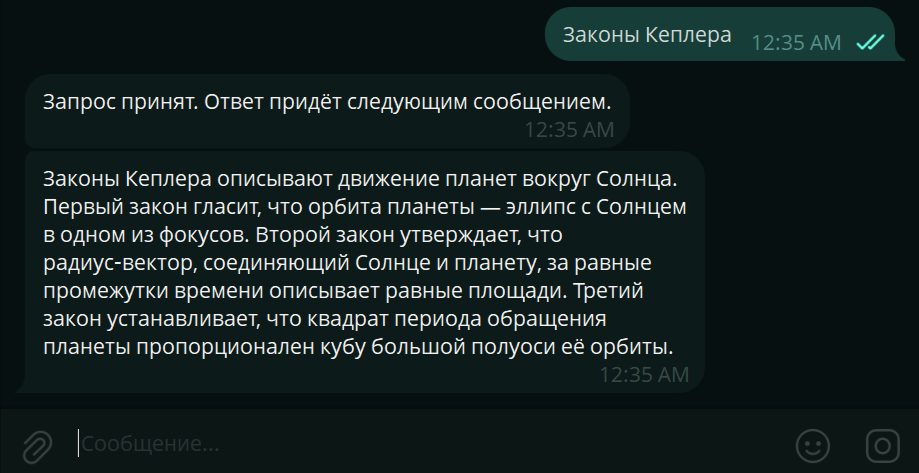

### 5. Интерфейс RabbitMQ
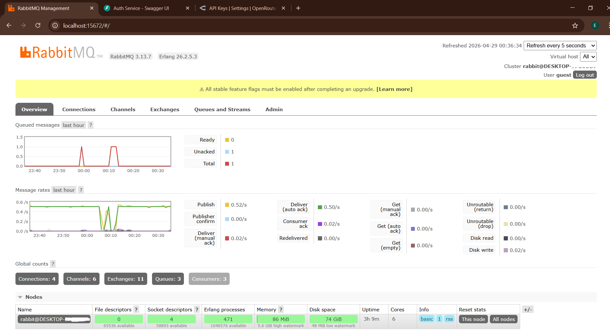


## Структура проекта

```bash
llm-consultation-system/
├── auth_service/
│   ├── app/
│   │   ├── api/
│   │   │   ├── deps.py              # Dependency Injection
│   │   │   └── routes_auth.py       # Эндпоинты /auth/*
│   │   ├── core/
│   │   │   ├── config.py            # Pydantic Settings
│   │   │   ├── exceptions.py        # HTTP-исключения
│   │   │   └── security.py          # JWT и bcrypt
│   │   ├── db/
│   │   │   ├── base.py              # Базовый класс SQLAlchemy
│   │   │   ├── models.py            # Модель User
│   │   │   └── session.py           # Асинхронная сессия
│   │   ├── repositories/
│   │   │   └── users.py             # Репозиторий пользователей
│   │   ├── schemas/
│   │   │   ├── auth.py              # Схемы регистрации и токена
│   │   │   └── user.py              # Публичная схема пользователя
│   │   ├── usecases/
│   │   │   └── auth.py              # Бизнес-логика
│   │   └── main.py                  # Точка входа FastAPI
│   ├── .env
│   ├── pyproject.toml
├── bot_service/
│   ├── app/
│   │   ├── bot/
│   │   │   ├── dispatcher.py        # Bot и Dispatcher
│   │   │   └── handlers.py          # Обработчики /token и текста
│   │   ├── core/
│   │   │   ├── config.py            # Настройки
│   │   │   └── jwt.py               # Проверка JWT
│   │   ├── infra/
│   │   │   ├── celery_app.py        # Конфигурация Celery
│   │   │   └── redis.py             # Redis-клиент
│   │   ├── services/
│   │   │   └── openrouter_client.py # Клиент OpenRouter
│   │   ├── tasks/
│   │   │   └── llm_tasks.py         # Celery-задача LLM
│   │   └── main.py                  # FastAPI (health-check)
│   ├── .env
│   ├── .env.example
│   ├── pyproject.toml
├── screenshots/
│   ├── fpj_authorize_1.png
│   ├── fpj_authorize_2.png
│   ├── fpj_post_1.png
│   ├── fpj_post_2.png
│   ├── fpj_rabbitmq_itfce.png
│   ├── fpj_regist_1.png
│   ├── fpj_regist_2.png
│   ├── fpj_regist_3.png
│   ├── fpj_scr_bot_1.png
│   ├── fpj_scr_bot_2.png
│   ├── fpj_scr_bot_3.png
│   ├── fpj_scr_bot_4.png
│   ├── fpj_scr_bot_5.png
│   ├── fpj_scr_bot_6.png
│   ├── fpj_scr_bot_7.png
├── .gitignore
└── README.md
```

*Примечание: файл `app.db` (база SQLite) создаётся автоматически при первом запуске и не включён в репозиторий.*


Автор : студент Захарина.

Лицензия

Проект создан в учебных целях.
